# Lesson 1: S3 Encryption

---

## 1. Encryption Methods Overview

| Method        | Key Management      | Encryption Location | Header / How to Enable | Notes / Exam Tips |
|---------------|------------------|------------------|----------------------|-----------------|
| **SSE-S3**    | AWS-managed        | Server-side       | `x-amz-server-side-encryption: AES256` | Default for new buckets, AES-256 |
| **SSE-KMS**   | AWS KMS-managed    | Server-side       | `x-amz-server-side-encryption: aws:kms` | Audit logs via CloudTrail, API limits apply (5k–30k/sec) |
| **SSE-C**     | Customer-provided  | Server-side       | Provide key in HTTP headers | Key never stored, HTTPS required |
| **Client-Side** | Customer           | Client-side       | Encrypt locally before upload | Full control over keys & encryption cycle, use Client-Side Encryption Library |

---

## 2. Encryption in Transit (Data in Flight)

- **Also called:** SSL / TLS
- **Endpoints:**
  - HTTP → Not encrypted
  - HTTPS → Encrypted
- **Recommendation:** Always use HTTPS
- **SSE-C:** HTTPS is mandatory for key transmission

**Enforcing HTTPS with Bucket Policy:**

```json
{
  "Version": "2012-10-17",
  "Statement": [
    {
      "Effect": "Deny",
      "Principal": "*",
      "Action": "s3:GetObject",
      "Resource": "arn:aws:s3:::your-bucket-name/*",
      "Condition": {
        "Bool": {"aws:SecureTransport": "false"}
      }
    }
  ]
}
```

## 3. Encryption Flow Diagram


## 4. Quick Exam Tips
- **SSE-S3**: Easy to use, default encryption.
- **SSE-KMS**: Strong control, auditing, but be aware of API request limits.
- **SSE-C**: Customer manages keys; HTTPS required.
- **Client-side encryption**: Complete control outside AWS.

> Always enforce HTTPS to secure data in transit.

# Lesson 2: SSE-KMS
- **Server-Side Encryption with KMS-managed keys**
- Provides **strong control and auditing**
- AKA **"double encryption based on KMS"**


# Lesson 3: S3 Default Encryption
- By default, **all new buckets use SSE-S3** for default encryption.
- Can be changed to **SSE-KMS** or another supported method.
- **Bucket policies** can enforce encryption:
  - Example: Deny PUT requests if encryption header is missing or incorrect.
  - Can force SSE-KMS or SSE-C usage.
- **Order of enforcement**:
  1. Bucket policies are evaluated **first**.
  2. Default encryption is applied automatically to new objects.

---

# Lesson 4: S3 CORS (Cross-Origin Resource Sharing)
- **CORS** allows or denies browser requests from different origins.
- **Origin components**: scheme/protocol, host, domain, port.
  - Example: `https://www.example.com` → protocol: HTTPS, port: 443, domain: www.example.com
- **Same-origin**: scheme + host + port match.
- **Cross-origin**: different host, domain, or port.
- **Browser behavior**:
  1. Sends **pre-flight request** (OPTIONS) to cross-origin.
  2. Cross-origin server responds with **Access-Control-Allow-Origin** headers.
  3. Browser allows request if headers permit.
- **S3 CORS application**:
  - Enable CORS on buckets storing assets (images, CSS, JS) accessed from different origins.
  - Can allow specific origins or all origins (`*`).
 


---

# Lesson 5: S3 MFA Delete
- **MFA Delete**: Extra security for destructive operations.
- Requires a **multi-factor authentication (MFA) code** before:
  1. Permanently deleting object versions.
  2. Suspending Versioning.
- **Non-destructive operations** (e.g., listing versions) **do not require MFA**.
- Requirements:
  - **Versioning must be enabled** on the bucket.
  - Only **bucket owner (root account)** can enable/disable MFA Delete.

---

# Lesson 6: S3 Access Logs
- **Purpose**: Audit all requests to S3 buckets.
- Logs include **authorized and denied requests**.
- Stored in a **different S3 bucket** in the same AWS region.
- Analyzed using tools like **Amazon Athena**.
- **Important**: Never set the logging bucket as the same bucket being monitored — this creates **infinite logging loops**.

---

# Lesson 7: S3 Pre-signed URLs
- **Pre-signed URL**: Temporary URL granting access to private objects.
- Can be generated via **S3 console, CLI, or SDK**.
- **Expiration**:
  - Console: up to 12 hours.
  - CLI: up to 168 hours.
- **Permissions**:
  - URL inherits the **permissions of the user generating it**.
  - Can allow GET (download) or PUT (upload).
- **Use cases**:
  - Allow logged-in users to download premium content.
  - Temporarily allow dynamic users to upload/download files.
  - Maintain bucket privacy while providing temporary access.
```mermaid
flowchart TD
    A[Generate Pre-signed URL] --> B[URL carries permissions of generator]
    B --> C[Send URL to user]
    C --> D[User accesses object temporarily (GET/PUT)]
    D --> E[Access expires after defined time]
```
---

# Lesson 8: Glacier Vault Lock and S3 Object Lock
## Glacier Vault Lock
- Implements **WORM (Write Once Read Many)** model.
- **Vault Lock Policy** prevents changes to the vault policy once locked.
- Objects in the locked vault **cannot be deleted or modified**, even by AWS or administrators.
- Useful for **compliance and legal data retention**.

## S3 Object Lock
- Must **enable versioning** on the bucket.
- Applies WORM model at **individual object level**.
- Protects specific object versions for a **retention period**.

**Retention Modes:**
1. **Compliance Mode**
   - Object **cannot be deleted or overwritten** by anyone (including root).
   - Retention period **cannot be shortened**.
2. **Governance Mode**
   - Most users **cannot delete or modify** object versions.
   - Admin users with IAM permissions **can override** settings.

**Legal Hold:**
- Protects objects **indefinitely**, independent of retention period.
- Controlled via IAM permission: `s3:PutObjectLegalHold`.

```mermaid
flowchart TD
    A[Upload Object] --> B{S3 Object Lock Enabled?}
    B -- Yes --> C[Choose Retention Mode]
    C --> D[Compliance: Strict WORM]
    C --> E[Governance: Admin Override Allowed]
    B -- No --> F[Normal S3 Object]
    D --> G[Retention Period enforced]
    E --> H[Retention Period enforced with possible admin override]
```


---

# Lesson 9: S3 Access Points

### What are S3 Access Points?
- Used to **simplify access management** for buckets with **large amounts of data** and **multiple users or groups**.
- Each access point can have its **own policy**, reducing the complexity of a single, large bucket policy.

---

### Example Scenario
- S3 bucket contains:
  - Finance data
  - Sales data
  - Analytics data
- Users/groups need access to specific data:
  - Finance users → finance data
  - Sales users → sales data
  - Analytics users → read-only access to both

---

### How Access Points Work
- **Finance Access Point**
  - Connected to `finance/` prefix
  - Policy grants **read/write access** to finance users
- **Sales Access Point**
  - Connected to `sales/` prefix
  - Policy grants **read/write access** to sales users
- **Analytics Access Point**
  - Points to `finance/` + `sales/` prefix
  - Policy grants **read-only access** to analytics users

- Security management is **pushed from bucket policy into individual access points**.
- Users access **only the data allowed by the access point policy**.


## Access Point Connectivity

- Each access point has a **unique DNS name**.
- Can be connected via:
  - **Internet** (public access)
  - **VPC** (private access)

### VPC Origin Access Points
- Allows **private connections** to S3 from within a VPC (e.g., EC2 instance).
- Requires a **VPC Endpoint**:
  - Endpoint policy must allow access to:
    - Target S3 bucket
    - Access points
- Provides **three layers of security**:
  1. Bucket policy
  2. Access point policy
  3. VPC endpoint policy

---

## Summary
- S3 Access Points **simplify security management at scale**.
- Policies can be **tailored to users/groups**.
- Can be **public or private** (VPC endpoints for private access).
- Enables **scalable, organized, and secure bucket access**.

---

# Lesson 10: S3 Object Lambda

### What is S3 Object Lambda?
- A feature that allows you to **modify objects on-the-fly** as they are retrieved from S3.
- Avoids creating multiple buckets for different object versions.
- Requires **S3 Access Points** to work.

---

### How it Works
1. **Original S3 Bucket**
   - E-commerce application stores and accesses original objects.

2. **Analytics Use Case**
   - Wants access to **redacted objects** (some sensitive data removed).
   - Steps:
     1. Create an **S3 Access Point** for the bucket.
     2. Connect the access point to a **Lambda function**.
     3. Lambda function **modifies/redacts** the object during retrieval.
     4. Analytics application receives the **redacted object**, without needing a separate bucket.

3. **Marketing Use Case**
   - Wants access to **enriched objects** (e.g., combine with customer loyalty data).
   - Steps:
     1. Create another **Lambda function** for enrichment.
     2. Connect it via an **S3 Object Lambda Access Point**.
     3. Marketing application retrieves **enriched objects** dynamically.

---

### Use Cases
- **Redacting PII** (Personally Identifiable Information) for analytics or non-production environments.
- **Data transformation**:
  - Convert XML → JSON
  - Modify data structure on-the-fly
- **Media processing**:
  - Resize images
  - Add watermarks specific to the user requesting the object

---

### Summary
- **S3 Object Lambda** allows one bucket to serve multiple data views.
- Uses **Lambda functions** to transform or enrich data dynamically.
- Simplifies management and avoids duplicating data for different use cases.
